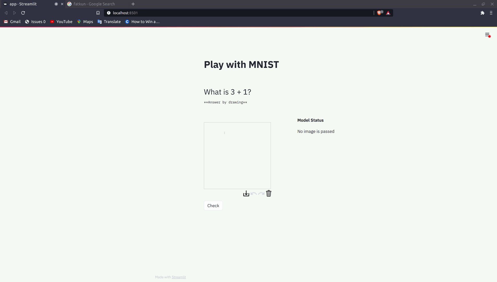

# Play-with-MNIST
Answer the asked sum by drawing. :art:

# Requirements and Dependencies
Clone the repository and install the dependencies using pip package manager.
```
python3 -m pip install -r requirements.txt
```

# Run
```
cd src
streamlit run app.py
```

# Demo


